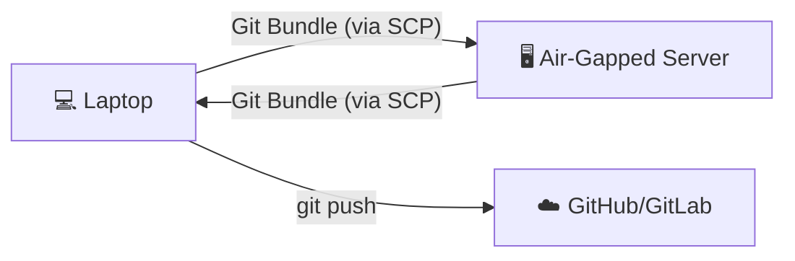

# 🔄 GitSynq

[](https://go.dev/)
[](LICENSE)
[](https://github.com/10xdev4u-alt/gitsynq/actions)

> **Sync Git repositories with air-gapped servers - No internet required on server! 🚀**

```text
   ██████╗ ██╗████████╗███████╗██╗   ██╗███╗   ██╗ ██████╗ 
  ██╔════╝ ██║╚══██╔══╝██╔════╝╚██╗ ██╔╝████╗  ██║██╔════╝ 
  ██║  ███╗██║   ██║   ███████╗ ╚████╔╝ ██╔██╗ ██║██║      
  ██║   ██║██║   ██║   ╚════██║  ╚██╔╝  ██║╚██╗██║██║      
  ╚██████╔╝██║   ██║   ███████║   ██║   ██║ ╚████║╚██████╗ 
   ╚═════╝ ╚═╝   ╚═╝   ╚══════╝   ╚═╝   ╚═╝  ╚═══╝ ╚══════╝
```

---

## 😫 The Problem

Thousands of developers, students, and researchers work on **remote servers** with **NO INTERNET ACCESS**.

- ❌ Cannot `git clone` or `git pull` from GitHub.
- ❌ Cannot `git push` their work back to the cloud.
- ❌ Manual file copying via SCP/SFTP is error-prone and loses history.
- ❌ Collaborating with team members becomes a nightmare.

## ✨ The Solution

**GitSynq** solves this by leveraging **Git Bundles**. It packages your changes into a single file, transfers it via SCP, and merges it on the remote side.

- ✅ Preserves full Git history, branches, and tags.
- ✅ Uses standard SSH for secure transfers.
- ✅ No software required on the server except `git`.
- ✅ Seamless workflow: Sync in seconds.

---

## 🚀 Quick Start

### Installation

```bash
# Using Go
go install github.com/10xdev4u-alt/gitsynq@latest

# Or build from source
git clone https://github.com/10xdev4u-alt/gitsynq
cd gitsynq
make install
```

### Basic Workflow

1. **Initialize** in your local repo:
   ```bash
   gitsync init
   ```

2. **Push** to the air-gapped server:
   ```bash
   gitsync push
   ```

3. **Pull** changes back from the server:
   ```bash
   gitsync pull --push
   ```

---

## 📖 Command Reference

| Command | Description |
|---------|-------------|
| `gitsync init` | Interactive setup for your project |
| `gitsync push` | Sync local changes to the remote server |
| `gitsync pull` | Fetch and merge changes from the server |
| `gitsync status` | Compare local and remote states |
| `gitsync config` | View or modify your configuration |

---

## 🔧 How It Works



1. **Push:** GitSynq creates a bundle of new commits, SCPs it to the server, and merges it into the remote repo.
2. **Pull:** GitSynq connects to the server, creates a bundle of remote commits, downloads it, and merges it locally.

---

## 🛠️ Configuration

GitSynq stores settings in `.gitsync.yaml` at the root of your project:

```yaml
project:
  name: my-awesome-project
  branch: main
server:
  host: 192.168.1.100
  user: prince
  port: 22
  remote_path: ~/projects
  ssh_key_path: ~/.ssh/id_ed25519
bundle:
  directory: .gitsync-bundles
  compress: true
  max_history: 10
```

---

## 🤝 Contributing

Contributions are welcome! See [CONTRIBUTING.md](CONTRIBUTING.md) for details.

## 📝 License

This project is licensed under the MIT License - see the [LICENSE](LICENSE) file for details.

---

Built with ❤️ by [PrinceTheProgrammer](https://github.com/10xdev4u-alt)
