# 🔄 GitSynq

[](https://go.dev/)
[](LICENSE)
[](https://github.com/10xdev4u-alt/gitsynq/actions)

> **The "Sneakernet" Killer. Sync Git repos with air-gapped servers over SSH. No internet? No problem. 🚀**

```text
   ██████╗ ██╗████████╗███████╗██╗   ██╗███╗   ██╗ ██████╗ 
  ██╔════╝ ██║╚══██╔══╝██╔════╝╚██╗ ██╔╝████╗  ██║██╔════╝ 
  ██║  ███╗██║   ██║   ███████╗ ╚████╔╝ ██╔██╗ ██║██║      
  ██║   ██║██║   ██║   ╚════██║  ╚██╔╝  ██║╚██╗██║██║      
  ╚██████╔╝██║   ██║   ███████║   ██║   ██║ ╚████║╚██████╗ 
   ╚═════╝ ╚═╝   ╚═╝   ╚══════╝   ╚═╝   ╚═╝  ╚═══╝ ╚══════╝
```

---

## 😫 The Struggle is Real

You know the vibe. You're a dev, a researcher, or a student. You have to work on a **remote server** that is locked down tighter than Fort Knox.

- 🚫 **No Internet:** `git clone`? Nope. `npm install`? Lol.
- 🐌 **SCP Hell:** Dragging ZIP files back and forth like it's 1999.
- 🤯 **Merge Conflicts:** "Wait, did I edit `main.go` on the server or my laptop?" *Proceeds to overwrite 3 hours of work.*

**Stop the madness.**

## ✨ Enter GitSynq

**GitSynq** is your bridge across the air-gap. It uses **Git Bundles** (Git's hidden superpower) to package your commits into a single file, shoots it over SSH, and merges it on the other side.

- ✅ **Full History:** Branches, tags, commit messages—it's all there.
- ✅ **Incremental:** Only transfers what changed. Fast AF.
- ✅ **Zero Server Deps:** If the server has `git` and `ssh`, you're golden.
- ✅ **Sanity Saved:** Develop locally with your fancy IDE, sync to the beast server in seconds.

---

## 🚀 Speedrun (Get Started in 30s)

### 1. Grab it

```bash
# Go fam
go install github.com/10xdev4u-alt/gitsynq@latest

# Or build from source (if you like to compile things)
git clone https://github.com/10xdev4u-alt/gitsynq
cd gitsynq && make install
```

### 2. Init it

Go to your local repo and tell GitSynq about your locked-down server:

```bash
gitsync init
# It'll ask you for IP, user, path... the usual suspects.
```

### 3. Push it

Send your code to the void (the server):

```bash
gitsync push
```

### 4. Pull it

Did you vim something on the server? Pull it back before you wreck yourself:

```bash
gitsync pull --push
# ^ This pulls changes AND auto-pushes to GitHub. Magic. 🪄
```

---

## 🧰 The Toolkit

| Command | What it does |
|---------|-------------|
| `gitsync init` | 🧙‍♂️ Interactive setup wizard. |
| `gitsync push` | 📤 Yeets your commits to the server. |
| `gitsync pull` | 📥 Yoinks changes from the server. |
| `gitsync watch` | 👀 Auto-syncs when you save a file. (Yes, really.) |
| `gitsync doctor`| 🩺 Tells you why things aren't working. |
| `gitsync backup`| 🛡️ Grabs a full backup bundle because you're paranoid. |
| `gitsync diff` | 🔍 Shows you exactly what's about to be synced. |

---

## 🗺️ The Future (Roadmap)

We are just getting started. Want to see where we're going? Check out our **[ROADMAP.md](ROADMAP.md)**.

We're planning:
- 🔐 Encrypted bundles (for the spies among us)
- 🔌 USB "Sneakernet" mode
- 🎮 TUI for conflict resolution

**[👉 Go here to see the full vision and how you can help!](ROADMAP.md)**

---

## 🔧 Under the Hood

```mermaid
graph LR
    A[💻 Laptop] -- "📦 Git Bundle (SSH)" --> B[🖥️ Air-Gapped Server]
    B -- "📦 Git Bundle (SSH)" --> A
    A -- "git push" --> C[☁️ GitHub/GitLab]
```



1. **Push:** GitSynq packages your new commits -> SCPs to server -> Merges into remote repo.
2. **Pull:** Server packages its new commits -> SCPs to laptop -> Merges into your local repo.

---

## 🤝 Join the Party

Open source is better with friends. Found a bug? Have a crazy feature idea?

1. Check [CONTRIBUTING.md](CONTRIBUTING.md)
2. Look at the [ROADMAP.md](ROADMAP.md) for inspiration
3. Open a PR and become a legend.

## 📝 License

MIT - Do whatever you want with it. Just don't blame us if you accidentally delete production (but `gitsync backup` helps with that).

---

Built with ☕ and ❤️ by [PrinceTheProgrammer](https://github.com/10xdev4u-alt)